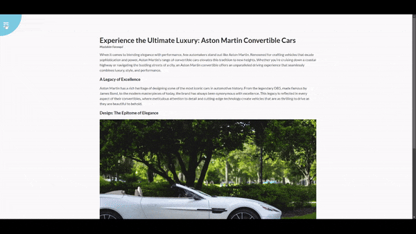

# Rotating Navigation

## 🚀 Overview

This project features a "Rotating Navigation" effect, where the entire webpage rotates when the navigation icon is clicked, providing a unique and dynamic user experience.

### 🎯 Project Goals:
- Rotate the entire webpage when the user clicks on the navigation icon.
- Change the navigation icon to indicate open/close status.
- Position navigation items at the bottom of the page.
- Structure the page with HTML, style it with CSS, and add interactive functionality using JavaScript.

## 🛠️ Built With

- [HTML5](https://www.w3schools.com/html/)
- [CSS3](https://www.w3schools.com/css/)
- [JavaScript](https://www.w3schools.com/js/)
